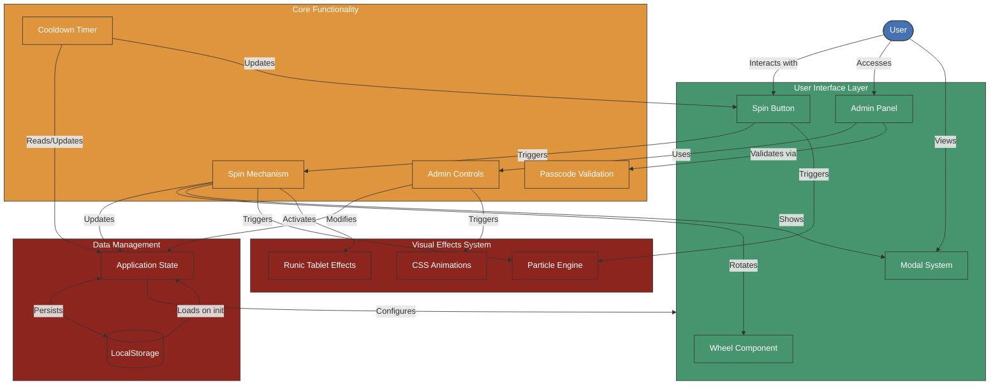

# Daily AI Prompt Wheel - Application Architecture

This document outlines the architecture of the Daily AI Prompt Wheel application, showing the main components and their relationships.

## Architecture Diagram

## Component Descriptions

### User Interface Layer
- **Wheel Component**: The central 5-segment wheel with ornate decorations
- **Admin Panel**: Interface for managing tips, background, and music
- **Modal System**: Handles tip display, admin access, and music settings
- **Spin Button**: Primary interaction point for users

### Core Functionality
- **Spin Mechanism**: Handles wheel rotation, segment selection, and cooldown
- **Cooldown Timer**: Manages 24-hour lockout period
- **Admin Controls**: Processes tip management and media uploads
- **Passcode Validation**: Secures admin and music settings

### Data Management
- **LocalStorage**: Persists application data in browser storage
- **Application State**: In-memory state management for the application

### Visual Effects System
- **Particle Engine**: Creates and manages magical particle effects
- **CSS Animations**: Handles transitions, glows, and ambient effects
- **Runic Tablet Effects**: Controls floating tablets and their behaviors

## Data Flow

1. On initialization, the application loads saved state from LocalStorage
2. User interactions trigger Core Functionality components
3. Core components update Application State and trigger Visual Effects
4. State changes are persisted to LocalStorage
5. UI components reflect the current application state

This architecture ensures separation of concerns while maintaining a cohesive user experience with rich visual effects.
